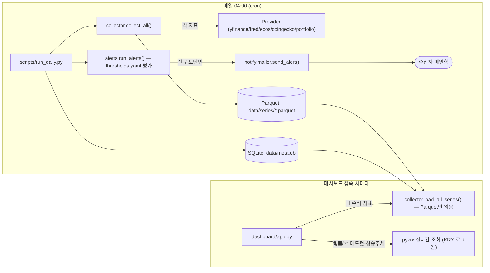
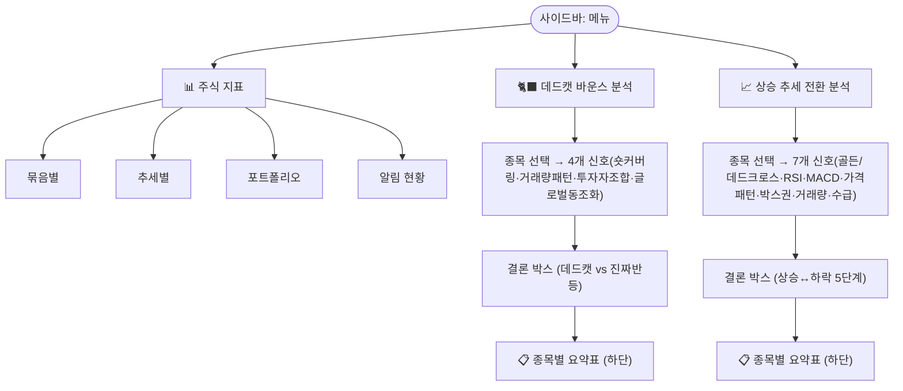

# 📊 Stock Index Dashboard

주식 투자에 필요한 다양한 지표를 매일 자동 수집하고, 수치와 그래프로 보여주는 오픈소스 대시보드.

## 기능

- **Config 기반 지표 관리**: `config/indicators.yaml`에서 지표 이름 + on/off + provider 설정
- **임의 묶음 구성**: `config/groups.yaml`에서 지표 묶음을 자유롭게 정의 (개수 제한 없음)
- **추세 자동 분류**: 상향 / 하향 / 울퉁불퉁 / 일정 — 같은 방향 지표끼리 모아 비교
- **단계별 임계치 알림**: `config/thresholds.yaml`에서 단계별 조건 설정, 도달 시 HTML 메일 발송
- **대시보드**: Streamlit + Plotly 인터랙티브 차트
- **국부펀드 포트폴리오**: 국민연금 자산배분 변화 추이 (표 + 스택 차트)
- **데드캣 바운스 분석**: 공매도·거래량·투자자별(외국인/기관/개인) 수급 + 글로벌 동조화 기준으로
  일시적 기술적 반등(데드캣 바운스)인지 진짜 추세 전환인지 판별하고, 어제 종가 기준 결론과 근거를 표시
- **상승 추세 전환 분석**: 이동평균 골든/데드크로스, RSI 50선, MACD, 가격 파동 패턴(N자/역N자),
  박스권 돌파, 거래량 급증, 외국인·기관 쌍끌이 매매 — 7가지 기준으로 상승/하락 추세 전환을 대칭적으로 판별
- **종목별 요약표**: 데드캣·상승추세 두 분석 페이지 모두, 선택 가능한 전체 종목을 한 번에 비교하는
  요약표를 페이지 하단에 제공
- **쉬운 설명 (초등학생도 이해하는 풀이)**: 두 분석 페이지 모두 "🧒 쉽게 설명해드릴게요!" 접이식(collapsed)
  섹션에서 각 지표를 비유로 풀어 설명하고, 상승 추세 분석 페이지는 5단계 결론("7명 친구에게 물어보기" 비유)도 함께 설명

데드캣 바운스 분석·상승 추세 전환 분석은 **사이드바 최상위 메뉴에서 서로 독립된 페이지**로 분리되어 있으며,
매일 수집되는 지표들과 달리 페이지를 열 때마다 KRX에서 실시간 조회합니다(자세한 구조는 [대시보드 페이지 구조](#대시보드-페이지-구조) 참고).

## 기본 지표

| 구분 | 지표 |
|---|---|
| 주가지수 | KOSPI200, KOSDAQ150, S&P500, NASDAQ100, CSI300, EuroStoxx50, Nikkei225 |
| ETF | 반도체 SOXX, SMH |
| 암호화폐 | 비트코인, 이더리움 |
| 원자재 | 금, 원유(WTI) |
| 변동성 | VIX |
| 환율 | USD/KRW, USD/JPY, USD/CNY, EUR/USD |
| 금리 | 미국 기준금리·2년·10년, 일본·유럽 10년, 한국 기준금리 |
| 거시지표 | 미국 CPI·실업률·GDP·M2·가계부채 |
| 국부펀드 | 국민연금 포트폴리오 |

## 아키텍처

전체 흐름은 **"매일 수집(cron)"**과 **"대시보드는 저장된 결과만 읽음"**으로 완전히 분리되어 있습니다.
단, 데드캣·상승추세 분석 두 페이지만 예외로 KRX를 실시간 조회합니다.



## 대시보드 페이지 구조

사이드바 최상위 메뉴는 3개 페이지로 완전히 분리되어 있습니다. "📊 주식 지표"만 조회 기간·정규화
컨트롤을 공유하고, 나머지 두 페이지는 각자 종목·기간을 직접 선택합니다.



## 빠른 시작 (Makefile)

```bash
make install          # 가상환경 생성 + 패키지 설치
make env              # .env 파일 생성 (API 키 입력 필요)
make nginx-install    # nginx 리버스 프록시 등록 (최초 1회, sudo 필요)
make service-install  # systemd 서비스 등록·자동시작 (최초 1회, sudo 필요)
make collect          # 데이터 수집
```

전체 타겟 목록은 `make help`로 확인할 수 있습니다.

---

## 설치 (수동)

```bash
git clone https://github.com/your-id/stock-index.git
cd stock-index
uv venv .venv && source .venv/bin/activate
uv pip install -e ".[dev]"
cp .env.example .env   # API 키 설정
```

## API 키 설정

| 서비스 | 용도 | 발급처 |
|---|---|---|
| FRED | 미국 금리·거시지표 | https://fred.stlouisfed.org/docs/api/api_key.html |
| 한국은행 ECOS | 한국 금리·거시지표 | https://ecos.bok.or.kr/api/ |
| SMTP | 임계치 알림 메일 | Gmail 앱 비밀번호 등 |
| CoinGecko | 코인 가격 | 무료 (키 없음, 365일 이내 데이터) |
| yfinance | 주가·ETF·환율·원자재 | 무료 (키 없음) |
| KRX (data.krx.co.kr) | 공매도·투자자별 수급 (데드캣·상승추세 분석) | 무료 회원가입 필요 (`KRX_ID`, `KRX_PW`). 미설정 시 주가·거래량 분석만 제공 |

`KRX_ID`/`KRX_PW`가 설정은 되어 있지만 값이 틀린 경우, `krx_provider.check_krx_login()`이
실제 로그인을 시도해 성공 여부를 확인합니다. 로그인 실패 시 두 분석 페이지 상단에
🚫 오류 메시지가 표시됩니다(콘솔 로그가 아니라 **화면에 직접** 표시됨).

## 사용법

### Makefile 타겟 전체 목록

| 타겟 | 설명 |
|---|---|
| `make install` | 가상환경 생성 + 런타임 패키지 설치 |
| `make install-dev` | 가상환경 생성 + dev(pytest 등) 포함 설치 |
| `make env` | `.env.example` → `.env` 복사 (이미 있으면 건너뜀) |
| `make collect` | 전체 지표 데이터 수집 |
| `make collect-dry` | 수집 테스트 (메일 미발송) |
| `make dashboard` | 대시보드 포그라운드 실행 (Ctrl+C로 종료) |
| `make stop` | 서비스 중지 |
| `make test` | pytest 실행 |
| `make lint` | ruff 코드 검사 |
| `make clean` | 캐시·빌드 산출물 삭제 |
| `make nginx-install` | nginx 리버스 프록시 등록 (최초 1회, sudo 필요) |
| `make nginx-reload` | nginx 설정 반영 (sudo 필요) |
| `make nginx-status` | nginx 상태 확인 |
| `make service-install` | systemd 서비스 등록·자동시작 (최초 1회, sudo 필요) |
| `make service-start` | 서비스 시작 |
| `make service-stop` | 서비스 중지 |
| `make service-restart` | 서비스 재시작 |
| `make service-status` | 서비스 상태 확인 |
| `make service-log` | 최근 로그 50줄 출력 |

### 데이터 수집
```bash
# Makefile 사용
make collect
make collect-dry   # 메일 미발송 테스트

# 직접 실행
python scripts/run_daily.py
python scripts/run_daily.py --keys sp500 vix gold bitcoin
python scripts/run_daily.py --dry-run
```

### 대시보드 실행

대시보드는 **systemd 서비스**로 관리합니다. 서버 재부팅 시 자동 시작되고, 비정상 종료 시 자동 재시작됩니다.

```bash
# 최초 1회 서비스 등록 (sudo 필요)
make service-install

# 이후 관리
make service-status   # 상태 확인
make service-restart  # 재시작
make service-log      # 로그 확인
make service-stop     # 중지
```

개발 중 포그라운드 실행이 필요한 경우:
```bash
make dashboard   # Ctrl+C로 종료
```

### 웹 접속

| 접속 경로 | URL |
|---|---|
| 외부 (인터넷, 홈페이지) | http://psncs.iptime.org/ |
| 외부 (인터넷, 대시보드) | http://psncs.iptime.org/stock_index/ |
| 로컬 | http://localhost:8501/stock_index |

외부 접속은 **nginx 리버스 프록시** (포트 80 `/stock_index/` → 8501) 를 통해 동작합니다.  
기존 서비스(`/`, `/stock_candle/`, `/infinite_buying/`, `/news/` 등)는 그대로 유지됩니다.  
포트 8501을 공유기에서 별도 포워딩할 필요 없습니다.

#### nginx 리버스 프록시 최초 설정 (1회)

기존 `/etc/nginx/conf.d/candle.conf` 에 `/stock_index` location 블록을 자동으로 추가합니다.

```bash
make nginx-install   # sudo 비밀번호 필요
```

설정 참고 파일: `nginx/stockindex.conf`  
패치 스크립트: `scripts/patch_nginx.py` (이미 추가된 경우 건너뜀)

#### systemd 서비스 파일

서비스 정의: `stockindex.service`  
로그 위치: `logs/dashboard.log`

서비스는 부팅 시 자동 시작(`WantedBy=multi-user.target`)되며,  
프로세스 종료 시 5초 후 자동 재시작(`Restart=always`)됩니다.

### 자동 수집 & 메일 내용을 매일 최신으로 유지하기

**이미 매일 자동으로 갱신되도록 설정되어 있습니다.** crontab에 아래 줄이 등록되어 있고,
매일 04:00에 `scripts/run_daily.py`가 실행되어 "수집 → 임계치 평가 → (도달 시) 메일 발송"까지
전부 자동으로 처리합니다. 즉 **별도 조치 없이도 메일 내용은 매일 최신 데이터를 기준으로 갱신됩니다.**

```
0 4 * * * cd /home/cheoljoo/code/stock_index && /home/cheoljoo/code/stock_index/.venv/bin/python /home/cheoljoo/code/stock_index/scripts/run_daily.py >> /home/cheoljoo/code/stock_index/logs/collect.log 2>&1
```

**동작 확인 방법**
```bash
crontab -l | grep stock_index     # 등록 여부 확인
tail -f logs/collect.log          # 실제 실행 로그 (매일 04시경 새 블록이 추가되는지)
```

**메일이 "매일 새 내용"으로 오는 이유**
- `collect_all()`이 매일 최신 시세를 다시 수집하므로 최신값(latest)이 갱신됩니다.
- `run_alerts()`는 그날 새로 임계치를 넘은 항목만 골라내고, **SQLite `alert_history`의
  UNIQUE(indicator, level, triggered_date) 제약**으로 같은 날 같은 단계는 중복 발송하지 않습니다.
  (`config/settings.yaml`의 `alert.suppress_duplicate_days`로 재발송 억제 기간 조정 가능)
- 도달 항목이 하루라도 없으면 그날은 메일이 오지 않는 게 정상입니다(`[alerts] 0 threshold(s) triggered`).

**메일 발송 조건/대상을 바꾸고 싶다면**
- 어떤 조건에서 메일을 보낼지 → `config/thresholds.yaml`의 `condition`/`notify` 수정
- 누구에게 보낼지 → `config/thresholds.yaml`의 `recipients` 수정
- 발송 시각을 바꾸고 싶다면 → `crontab -e`로 `0 4 * * *` 부분만 수정 (예: 매일 18시 → `0 18 * * *`)
- 메일이 아예 안 보내진다면 → `.env`의 `SMTP_PASSWORD`가 비어있는지 확인 (비어있으면 발송을 건너뛰고
  콘솔에 "Would send to: ..."만 출력)

**주의**: 🐈‍⬛ 데드캣 바운스·📈 상승 추세 전환 분석 페이지는 이 cron 파이프라인과 **무관**합니다.
두 페이지는 대시보드를 열 때마다 KRX에서 실시간 조회하므로 항상 "그 순간" 기준으로 최신이며,
메일로는 발송되지 않습니다(원하면 향후 `run_daily.py`에 결과 요약을 추가해 메일에 포함시킬 수 있습니다).

수동으로 crontab을 등록하거나 수정하려면:
```bash
crontab -e
```

### 테스트
```bash
make test
# 또는
pytest tests/ -v
```

## 지표 추가 방법

`config/indicators.yaml`에 블록만 추가하면 코드 수정 없이 동작합니다:

```yaml
indicators:
  my_new_indicator:
    enabled: true
    display_name: "새 지표"
    provider: yfinance      # yfinance | fred | coingecko | ecos | portfolio
    symbol: "AAPL"
    unit: "USD"
    category: equity
    trend_window: 20
```

## 새 데이터 소스 추가 방법

```python
# src/stockindex/providers/my_provider.py
from stockindex.providers.base import Provider

class MyProvider(Provider):
    name = "my_source"  # 이름만 정하면 자동 등록

    def fetch(self, symbol, start, end):
        # ... 데이터 가져오는 로직 ...
        return pd.Series(...)
```

그런 다음 `src/stockindex/providers/__init__.py`에 import 추가, config에서 `provider: my_source` 사용.

## 데이터 소스 및 라이선스

| 소스 | 용도 | 라이선스/약관 |
|---|---|---|
| [yfinance](https://github.com/ranaroussi/yfinance) | 주가·ETF·환율·원자재 | Apache 2.0 (Yahoo Finance 약관 준수 필요) |
| [FRED (Federal Reserve)](https://fred.stlouisfed.org) | 미국 금리·거시지표 | Public domain, FRED ToS 준수 |
| [한국은행 ECOS](https://ecos.bok.or.kr/api/) | 한국 금리·거시지표 | 공공데이터 이용허락 |
| [CoinGecko](https://www.coingecko.com/en/api) | 코인 가격 | CoinGecko ToS 준수 |
| [국민연금 공시](https://fund.nps.or.kr) | 포트폴리오 | 공개 공시 데이터 |
| [KRX 정보데이터시스템](https://data.krx.co.kr) ([pykrx](https://github.com/sharebook-kr/pykrx)) | 공매도·투자자별 수급 (데드캣·상승추세 분석) | KRX 이용약관 준수, 무료 회원 로그인 필요 |

> **면책조항**: 본 프로젝트는 투자 조언을 제공하지 않습니다. 데이터 정확성을 보장하지 않으며, 투자 결정에 대한 책임은 사용자에게 있습니다.

## 라이선스

MIT License — 자유롭게 사용, 수정, 배포 가능합니다.
